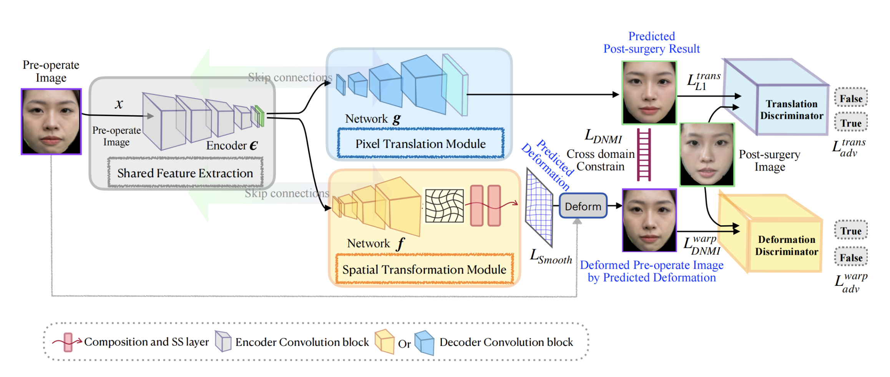
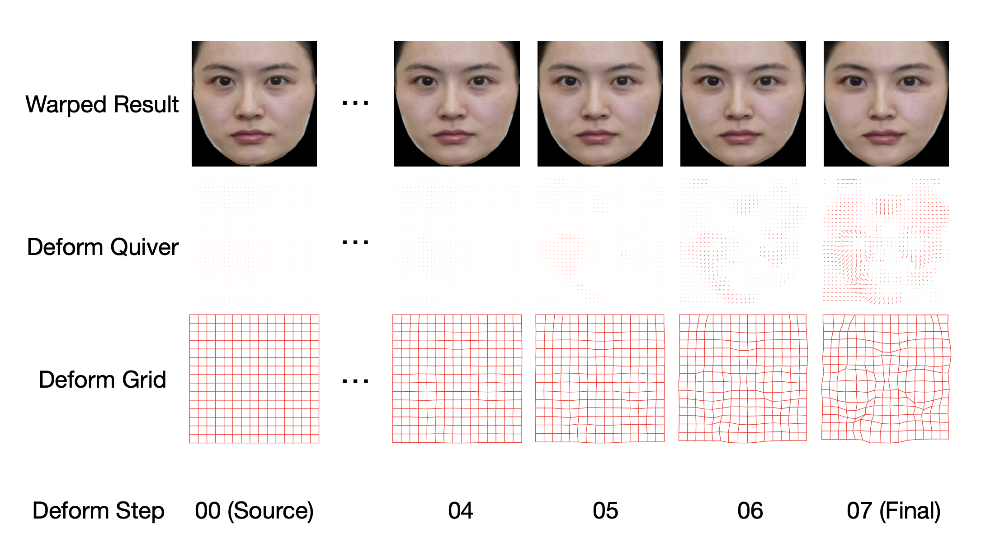
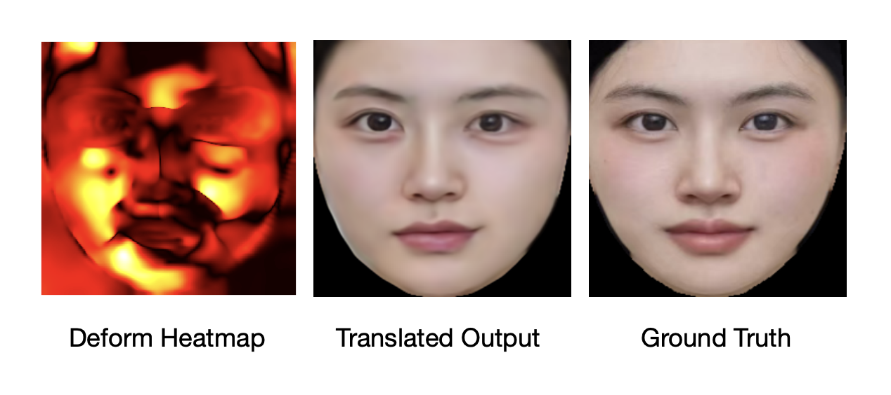

# TraceTrans : Translation and Spatial Tracing for Surgical Prediction

📄 

⚠️ **Notice: Some of the Code Temporarily Private Due to Patent Pending**

Due to a pending patent application, **some of** the source code for this project is currently **private**.

We plan to make the full code **public** as soon as the patent application process is complete. Thank you for your understanding and patience.

---

### Model Architecture Overview

### Deformation Steps Overview

  
  

---

## License

This project is licensed under the **Creative Commons Attribution-NonCommercial 4.0 International (CC‑BY‑NC 4.0)** license.
You may copy, modify, and redistribute the code for **non-commercial purposes**, with proper attribution to the original authors.

**Academic and research use is explicitly welcomed**. You are encouraged to use this code for experiments, publications, or educational purposes, provided that any resulting work gives appropriate credit.

Commercial use, redistribution, or incorporation into a commercial product without explicit permission from the copyright/patent holder is **prohibited**.

Full license text: [CC BY‑NC 4.0 Legal Code](https://creativecommons.org/licenses/by-nc/4.0/legalcode)

